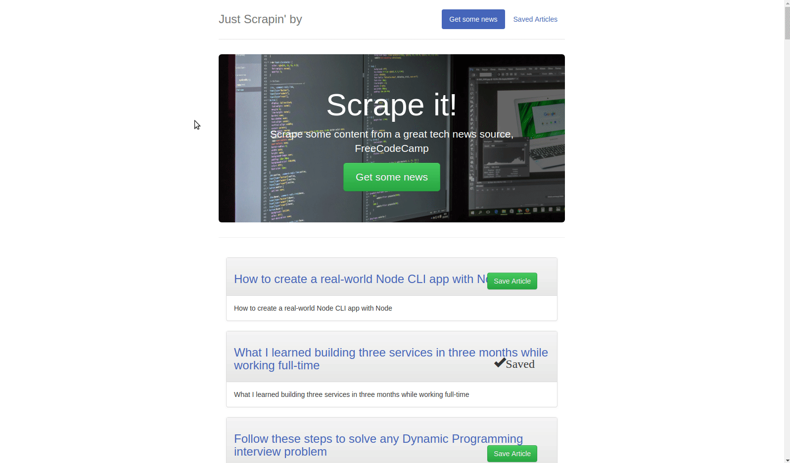
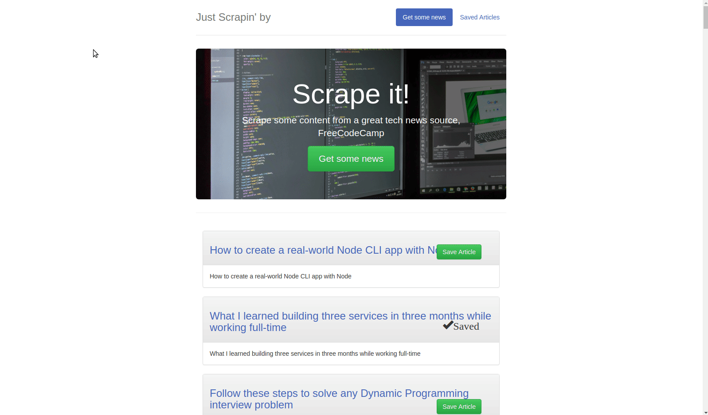

# Just Scrapin' by

## Scraping tool to compile news articles, make custom lists and add comments.

## Built with nodeJS, Express, Mongo, Mongoose, AJAX and jQuery.

## How it works

1. Scrape articles from news site by clicking on "Get some news".

2. Save the articles you prefer and would like to comment on.

3. Another GIF for the comments feature

